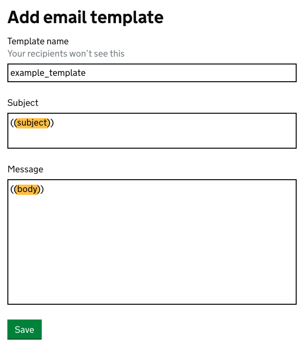

[](https://circleci.com/gh/pezholio/mail-notify) [](https://badge.fury.io/rb/mail-notify)

# Mail::Notify

Rails / ActionMailer support for the [GOV.UK Notify API](https://www.notifications.service.gov.uk).

## Installation

Add this line to your application's Gemfile:

```ruby
gem 'mail-notify'
```

And then execute:

    $ bundle

Or install it yourself as:

    $ gem install mail-notify

Then, add the following to your `config/environments/*.rb` (where * is `test`, `development`, `production` or whatever other environment(s) you have) file(s):

```ruby
config.action_mailer.delivery_method = :notify
config.action_mailer.notify_settings = {
  api_key: YOUR_NOTIFY_API_KEY
}
```

### Mailers

There are two options for using `Mail::Notify`, either templating in Rails with a view, or templating in Notify. Whichever way you choose, you'll need your mailers to inherit from `Mail::Notify::Mailer` like so:

```ruby
class MyMailer < Mail::Notify::Mailer
end
```

#### With a view

Out of the box, Notify offers support for templating, with some rudimentary logic included. If you'd rather have your templating logic included with your source code for ease of access, or you want to do some more complex logic that's not supported by Notify, you can template your mailer views in erb.

For this to work with Notify, you'll need a very simple template set up in Notify, with a `((subject))` variable in the subject line, and a `((body))` variable in the body field, as below:



Next, in your mailer you'll need to call `view_mail` with the first parameter being the ID of the notify template, followed by a hash of email headers e.g:

```ruby
class MyMailer < Mail::Notify::Mailer
    def send_email
        notify_mail('YOUR_TEMPLATE_ID_GOES_HERE',
          to: 'mail@somewhere.com',
          subject: 'Subject line goes here'
        )
    end
end
```

Your view can then be a simple `text.erb` file. You can add some markdown for headers, bullet points and links etc. These are handled in the same way as standard action_mailer views.

#### With Notify templating

You can also send your customisations in the more traditional way, and do your templating in Notify if you prefer. For this, you'll need to call `template_mail`, again with the first parameter being the ID of the template, and a hash of email headers, including your personalisations, e.g:

```ruby
class MyMailer < Mail::Notify::Mailer
    def send_email
        template_mail('YOUR_TEMPLATE_ID_GOES_HERE',
          to: 'mail@somewhere.com',
          personalisations: {
              foo: 'bar'
          }
        )
    end
end
```

## Development

After checking out the repo, run `bin/setup` to install dependencies. Then, run `rake spec` to run the tests. You can also run `bin/console` for an interactive prompt that will allow you to experiment.

To install this gem onto your local machine, run `bundle exec rake install`. To release a new version, update the version number in `version.rb`, and then run `bundle exec rake release`, which will create a git tag for the version, push git commits and tags, and push the `.gem` file to [rubygems.org](https://rubygems.org).

## Contributing

Bug reports and pull requests are welcome on GitHub at https://github.com/[USERNAME]/mail-notify. This project is intended to be a safe, welcoming space for collaboration, and contributors are expected to adhere to the [Contributor Covenant](http://contributor-covenant.org) code of conduct.

## License

The gem is available as open source under the terms of the [MIT License](https://opensource.org/licenses/MIT).

## Code of Conduct

Everyone interacting in the Mail::Notify project’s codebases, issue trackers, chat rooms and mailing lists is expected to follow the [code of conduct](https://github.com/[USERNAME]/mail-notify/blob/master/CODE_OF_CONDUCT.md).
